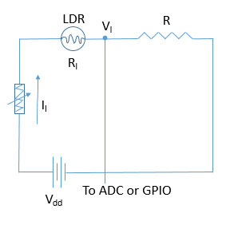
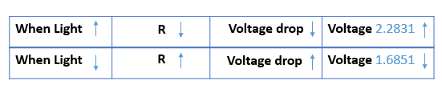

### Novice pitfalls of working with LDR on RaspberryPi

#### Basics of a LDR sensor
Light Dependent Resistor, commonly known as LDR and used as a light sensor - is a device whose resistance is inversely proportional to the ambient light.
Following graph illustrates the same:


### Basic circuit and Equations
Here, we have a LDR whose output is fed to the RaspberryPi.

##### Illustration
Circuit Diagram


We want to measure the voltage drop across LDR. A 10K ohm resistor is connected in series with the LDR to measure the drop.
Following equations explain the phenomenon in theory:

##### Equations
```
Vdd = 3.3v
Vdd = Vl + Vr
Vdd = Il*Rl + Il*R
Il = (Vdd )/ (Rl + R)
or
Vl/Rl = (Vdd )/ (Rl + R)
Finally, Vl , the voltage across LDR is equated as
Vl = (Vdd * Rl)/(Rl +R)
```


### Pitfalls to avoid
As simple as an LDR functioning principle may sound, working with LDR to get accurate values might get tricky with unexpected pitfalls. Below, I have discussed two of such pitfalls:
##### 1.  An input voltage of 3.3V directly supplied to the LDR
   If we supply a 3.3 volts directly to the LDR,
   chances are that we might end up supplying a high voltage as an input to the GPIO of RPi.
   causing it to fail. This is because, the maximum voltage that we should input to RPi should not exceed 3.3 volts. So, we should add a potentiometer to restrict the supply voltage to LDR.
   Our updated circuit looks like the following:

Circuit Diagram with potentiometer



##### 2. No Voltage divider circuit

Following table illustrates the relationship of LDR with the resistance and voltage



  To measure the actual output of LDR, we should introduce a voltage divider circuit by connecting a Resistor of say, 10Kohms in series to the LDR.
