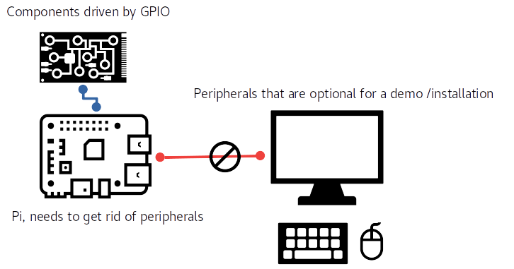

## Sensing loops on Pi as upstarted services :
****

### The pain of carrying Pi peripherals.
****



I had to, on multiple occassions carry a VGA / HD screen alongside a keyboard that can be attached to the Pi. Demos required at the workplace required me to carry the entire working prototype to locations at my work-campus. This was even more cumbersome when the number of discrete electronics on the bread board started piling up. On each of occassions I had to connect the monitor , keyboard and manually start the program on the Pi and then speak about it.

I kept wishing for a better way to do this. While I knew there had to be a professional way to get around this , just did not know **how?**. What's amusing - Despite being aware of `systemd` upstarting service units on Linux , I never had thought of applying them to this effect.

> When you are into an idea , one tends to miss out on the width of the subject matter. Only when you have satisfactory results would you then try experiments with other moving parts.

I was perhaps so held up with getting correct values from the sensor , this just conveniently slipped me.

### Upstarting services
****

Getting the desired program run at the start as a `systemd` unit instantly gets rid of the need to carry around the peripherals. One can turn on the Pi and expect things to crank up just as desired.Pi would mostly fire-up servics that run infinite loops of sensing at regular intervals.  

Majority of the projects that I worked on have this chracteristic.

`initd` on the flipside can be tricky since units are blocking, and if are spawned at the wrong time.

While `systemd` does not have sequential nature of upstarting, you can breathe a sigh of relief knowing the Raspbian Jessie uses `systemd`.But for an one-off case here is how you can still mess up your Pi working on `systemd` itself.

**Don't try the steps below, this may lead to Pi being inaccessible over the network and hungup on the boot ! Leaving you no choice but to flash the SD card and reload evrything again.**

```bash
$ cat /etc/systemd/system/some.service
[Unit]
Description=This is to test a service that runs an infinite loop of sensing.
[Service]
#this is where it goes seriously wrong.
Type=forking
ExecStart=path/to/exectuable
[Install]
WantedBy=multi-user.target
# and the following commands to enable and start the service
$ sudo systemctl enable some.service
$ sudo systemctl daemon-reload
$ sudo shutdown -r now

# ..Pi restarts but is hung up !
```
If you working from your laboratory and have setup ssh connections to your Pi, you would find you are unable to get into the Pi. The forking service is busy doing its sensing loop and occupies almost the entire processing power.As a last resort, you can try connecting a monitor, keyboard, mouse to the Pi to see if you can access the terminal. But if not, **time to flash the SD card and reload Raspbian**.

If you are one of those lucky guys who still have access to the terminal despite the ssh not working, here is what you can instantly do to salvage the Pi.

```bash
# the emergency rescue
$ sudo systemctl disable some.service
$ sudo shutdown -r now
```

#### Replacing forking services with simple services that run inifinite loops with desired safe run levels:
****

`systemd` was a graduation from `initd` and the significant change that we have here is that upstarted services are spawned asynchronously with none of them blocking the entire stack of services. `Type=simple` is the one that you should be choosing , instead of the notorious `forking`. Forking indicates it is a legacy service and the system then handsover the responsibility to the code to be asynchrounous. If not the system just hangs up!

One also has to be careful of run levels: `WantedBy=multi-user.target`. To be on the safer side you can choose a level that is lower in order something like `WantedBy=graphical.target`.  This ensures all the network services including the ssh is cranked up before the service you are trying to spawn. In an accident you atleast have a window to get inside the Pi to stop the faltering service.

#### Schema of services :
****

I would suggest you to have a service that acts as a "governor" that deals with restart and safe shutdown. In turn spaws out a "loop" that senses. Effectively we are dealing with 2 executables. One for the continuous loop that senses, would be the child of the governor process that deals with user commands.

I prefer to have 2 hadware push buttons on the GPIO mapping to

- Restarting the sensing loop. (Parent-child process)
- Shutdown the Pi safely issuing commands to the system

This lets me drop off the peripherals that I mentioned above from the demo setup outside the laboratory.

#### Constructing the governor service :
****
```c
#include <stdlib.h>
#include <stdio.h>
#include <wiringPi.h>
#include <signal.h>
#include <lcd.h>
#include <time.h>
#include <unistd.h>
#include <sys/types.h>
#include <sys/wait.h>

#define RESTART_GPIO 21
#define DEBOUNCE 200 //falling GPIO debounce time ..
pid_t pid;
/*This clears up the child process (looping sensing process ) when we have the user press the button*/
void on_force_restart(){
  // this service just restarts itself
  static unsigned long lastHit = 0;
  unsigned long latestHit  = millis();
  if(latestHit -lastHit > DEBOUNCE){
    printf("Restarting the service..\n");
    kill(pid, SIGTERM); //back to to waitpid call
  }
  lastHit = latestHit;
}
/*this is when the parent process itself is forced terminated*/
void upon_terminate(int sig){
  printf("Parent service is being shutdown..");
  kill(pid, SIGTERM); // we are sending this back to the waitpid call.
  sleep(1);
  exit(0);
}
int main(int argc, char const *argv[]) {
  signal(SIGINT, upon_terminate);
  signal(SIGTERM, upon_terminate);
  signal(SIGKILL, upon_terminate);
  /*this sets up the GPIO on Pi*/
  wiringPiSetupGpio();
  pinMode(RESTART_GPIO, INPUT);
  pullUpDnControl(RESTART_GPIO, PUD_UP);
  /*refer to wiringPi documentation to know more how to catch interrupts from the buttons*/
  /**/
  wiringPiISR(RESTART_GPIO,INT_EDGE_FALLING, &on_force_restart);
  pid  = fork(); /*refer : */
  if (pid ==0 ) {
    /*This is in the duplicate child process we are trying to crank up the sensing loop */
    static char *argv[]={};
    /*execv would replace the child process with the running sensing loop*/
    if ((execv("./looping",argv))==-1) {
      /* incase its a service then it would not work from the relative directory*/
      if ((execv("/home/pi/src/looping/looping",argv))==-1){
        perror("Failed to start the looping process");
        exit(127);
      }
    }
  }
  else{
    /*this is in the main process that spawns the child procss*/
    int status;
    waitpid(pid, &status, 0);
    printf("The looping process is called off.. ");
    sleep(3);
    printf("Now shutting down..");
  }
  return 0;
}

```
We need the diagramatic illustration of the above process forking.

Whats interesting is to note what happens when you have `fork()`ed the process.

- It creates a duplicate copy of the process from where `fork()` was being called
- All the state - stack variables and the shared variables are copied into this new process.
- Process Id from within the newly created child process is 0 while the actual processId of the child as seen from the parent is non zero positive integer. - That is ofcourse when the forking has been successful.
- `execv()` is from inside the child process
- `waitpid()` is from the parent process. It suspends the parent process till the state of the child is changed.
- `kill()` in the parent process then takes the Id of the child and sends in the `SIGTERM` signal indicating it to quit ASAP.

And here is how the systemd unit looks like

```
[Unit]
Description=This cranks up the governor service
[Service]
Type=simple
ExecStart=/path/to/the/execuable/above
[Install]
WantedBy=graphical.target
```

```bash
$ sudo systemctl enable governor.service
$ sudo systemctl daemon-reload
$ sudo systemctl start governor.service
```

#### The sensing loop :
****
For brevity sake I would not enlist the sensing loop here. All what you need is some GPIO operations that are running inside a infinite loop. This is the child process that gets spwaned from the main service.

#### References
****
- [[1]](https://thenounproject.com/) : Icon / illustrations credits to "The noun project".
- [[2]](http://www.csl.mtu.edu/cs4411.ck/www/NOTES/process/fork/create.html) : About forking processes and waitpid on Linux
- [[3]](http://wiringpi.com/reference/priority-interrupts-and-threads/) : About WiringPi and programming for interrupts
- [[4]](https://www.tecmint.com/systemd-replaces-init-in-linux/) : About systemd and differences to initd

#### Contact
****

[kneerunjun](kneerunjun@gmail.com) is a IoT device programmer and a tinkerer.He has programmed on Rpi extensively for building small scale cloud connected solutions. When he is not programming he is a evangelist on web development technologies.
